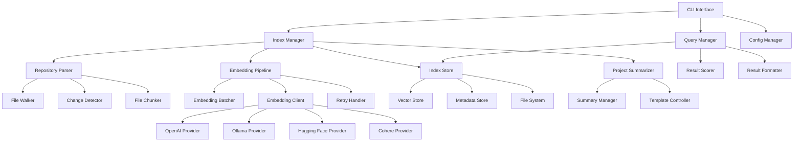
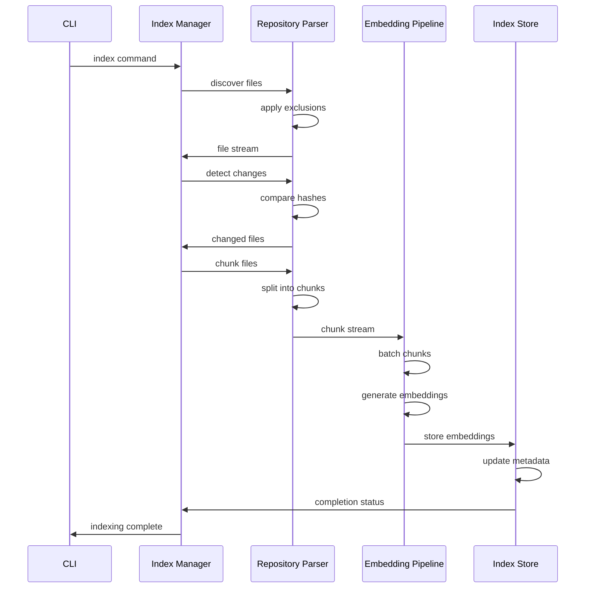
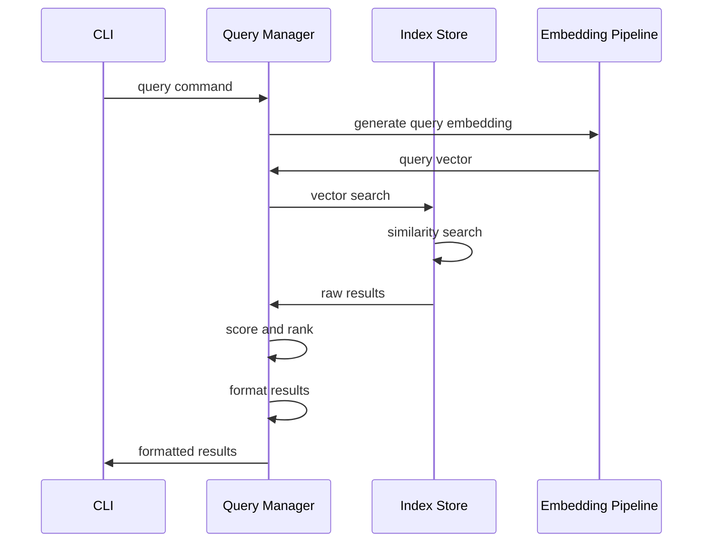

# Ziri Architecture Overview

This document provides a comprehensive overview of Ziri's architecture, design decisions, and data flow patterns.

## System Overview

Ziri is a high-performance AI code context CLI built with a modular, streaming architecture designed for scalability and flexibility. The system transforms code repositories into searchable vector databases using various embedding providers.

### Core Design Principles

1. **Performance First**: Concurrent processing, intelligent batching, and memory optimization
2. **Provider Agnostic**: Unified interface supporting multiple embedding providers
3. **Repository Isolation**: Each repository maintains its own isolated index store
4. **Incremental Updates**: Only process changed files for fast re-indexing
5. **Streaming Architecture**: Memory-efficient processing of large repositories
6. **Fault Tolerance**: Robust error handling with automatic recovery

## High-Level Architecture



## Core Components

### 1. CLI Interface Layer

The CLI layer provides the user-facing interface and command routing.

**Key Components:**
- Command parser and validation
- Progress reporting and user feedback
- Configuration management interface
- Error handling and user-friendly messages

**Responsibilities:**
- Parse and validate user commands
- Route commands to appropriate managers
- Display progress and results
- Handle user interruptions gracefully

### 2. Index Manager

The Index Manager orchestrates the entire indexing process and serves as the main controller.

**Key Components:**
- Indexing workflow orchestration
- Repository state management
- Progress tracking and reporting
- Error recovery and fallback handling

**Responsibilities:**
- Coordinate file discovery, processing, and storage
- Manage incremental vs. full indexing decisions
- Track indexing progress and performance metrics
- Handle errors and implement recovery strategies

### 3. Repository Parser

The Repository Parser handles all file system operations with streaming and change detection.

**Key Components:**
- **File Walker**: Discovers files with exclusion pattern support
- **Change Detector**: Identifies modified, added, and deleted files
- **File Chunker**: Splits large files into manageable chunks

**Responsibilities:**
- Traverse repository file system efficiently
- Apply exclusion patterns and filters
- Detect file changes using hashes and timestamps
- Chunk files for optimal embedding processing

### 4. Embedding Pipeline

The Embedding Pipeline manages concurrent embedding generation with intelligent optimization.

**Key Components:**
- **Embedding Batcher**: Groups chunks for optimal API utilization
- **Embedding Client**: Unified interface for all providers
- **Retry Handler**: Implements exponential backoff and error recovery

**Responsibilities:**
- Batch chunks for efficient API usage
- Manage concurrent requests with rate limiting
- Handle provider-specific optimizations
- Implement robust retry logic with backoff

### 5. Index Store

The Index Store provides isolated, efficient storage for each repository.

**Key Components:**
- **Vector Store**: High-performance vector database (FAISS-based)
- **Metadata Store**: Repository and file metadata management
- **File System**: Organized storage structure

**Responsibilities:**
- Store and retrieve vector embeddings efficiently
- Maintain repository isolation and data integrity
- Manage metadata for change detection
- Provide fast similarity search capabilities

### 6. Query Manager

The Query Manager handles search queries and result processing.

**Key Components:**
- **Result Scorer**: Relevance scoring and ranking
- **Result Formatter**: Output formatting and presentation
- **Query Optimizer**: Query preprocessing and optimization

**Responsibilities:**
- Process and optimize search queries
- Perform vector similarity search
- Score and rank results by relevance
- Format results for user consumption

## Data Flow

### Indexing Flow



### Query Flow



## Storage Architecture

### Repository Isolation

Each repository gets its own isolated storage directory to prevent cross-contamination:

```
~/.ziri/repositories/
├── {repo-hash-1}/
│   ├── vectors.db          # FAISS vector index
│   ├── metadata.json       # Repository metadata
│   ├── file-hashes.json    # Change detection data
│   ├── chunks.json         # Chunk metadata
│   └── project_summary.md  # Generated summary
└── {repo-hash-2}/
    ├── vectors.db
    ├── metadata.json
    ├── file-hashes.json
    ├── chunks.json
    └── project_summary.md
```

### Vector Storage Schema

```typescript
interface VectorRecord {
  id: string              // Unique chunk identifier
  vector: Float32Array    // Embedding vector
  content: string         // Original text content
  filePath: string        // Source file path
  startLine: number       // Chunk start line
  endLine: number         // Chunk end line
  fileHash: string        // File hash for change detection
  chunkHash: string       // Chunk-specific hash
  createdAt: Date         // Indexing timestamp
  metadata: ChunkMetadata // Additional metadata
}

interface ChunkMetadata {
  language: string        // Programming language
  fileType: string        // File extension
  fileSize: number        // Original file size
  chunkSize: number       // Chunk character count
  tokenCount: number      // Estimated token count
}
```

### Metadata Schema

```typescript
interface RepositoryMetadata {
  repositoryId: string
  repositoryPath: string
  repositoryHash: string
  lastIndexed: Date
  lastModified: Date
  version: string
  
  // File tracking
  totalFiles: number
  indexedFiles: number
  excludedFiles: number
  fileHashes: Map<string, FileMetadata>
  
  // Embedding info
  embeddingProvider: string
  embeddingModel: string
  embeddingDimensions: number
  totalChunks: number
  totalTokens: number
  
  // Performance metrics
  indexingDuration: number
  averageChunkSize: number
  compressionRatio: number
}

interface FileMetadata {
  path: string
  hash: string
  size: number
  lastModified: Date
  language: string
  chunkCount: number
  tokenCount: number
}
```

## Provider Architecture

### Provider Abstraction

All embedding providers implement a common interface for consistency:

```typescript
interface EmbeddingProvider {
  name: string
  type: ProviderType
  config: ProviderConfig
  
  // Core methods
  embed(texts: string[]): Promise<number[][]>
  validateConfig(): Promise<boolean>
  getModelInfo(): ModelInfo
  
  // Provider-specific optimizations
  getOptimalBatchSize(): number
  getRateLimit(): RateLimit
  supportsStreaming(): boolean
}

interface ProviderConfig {
  apiKey?: string
  baseUrl?: string
  model: string
  dimensions: number
  maxTokens: number
  timeout: number
  retryAttempts: number
}
```

### Provider Implementations

#### OpenAI Provider
- Uses OpenAI's embedding API
- Supports multiple models (ada-002, text-embedding-3-small/large)
- Implements intelligent rate limiting
- Handles API key rotation

#### Ollama Provider
- Connects to local Ollama instance
- Supports various open-source models
- No API key required
- Optimized for local processing

#### Hugging Face Provider
- Uses Hugging Face Inference API
- Supports sentence-transformers models
- Handles model loading delays
- Implements caching for repeated requests

#### Cohere Provider
- Uses Cohere's embedding API
- Supports multilingual models
- Implements batch optimization
- Handles API versioning

## Performance Optimizations

### Concurrent Processing

```typescript
class ConcurrentProcessor {
  private concurrency: number
  private semaphore: Semaphore
  private activeRequests: Set<Promise<any>>
  
  async process<T>(
    items: T[],
    processor: (item: T) => Promise<any>,
    concurrency: number = this.concurrency
  ): Promise<any[]> {
    // Implementation with controlled concurrency
  }
}
```

### Intelligent Batching

```typescript
class AdaptiveBatcher {
  private currentBatchSize: number
  private responseTimeHistory: number[]
  private errorRateHistory: number[]
  
  adaptBatchSize(responseTime: number, success: boolean): number {
    // Adjust batch size based on performance metrics
    if (success && responseTime < this.targetResponseTime) {
      return Math.min(this.currentBatchSize * 1.2, this.maxBatchSize)
    } else if (!success || responseTime > this.targetResponseTime) {
      return Math.max(this.currentBatchSize * 0.8, this.minBatchSize)
    }
    return this.currentBatchSize
  }
}
```

### Memory Management

```typescript
class MemoryManager {
  private memoryLimit: number
  private currentUsage: number
  private checkpoints: Map<string, any>
  
  async processWithMemoryLimit<T>(
    stream: AsyncIterable<T>,
    processor: (batch: T[]) => Promise<void>
  ): Promise<void> {
    // Stream processing with memory monitoring
    let batch: T[] = []
    
    for await (const item of stream) {
      batch.push(item)
      
      if (this.shouldFlushBatch(batch)) {
        await processor(batch)
        batch = []
        await this.createCheckpoint()
      }
    }
    
    if (batch.length > 0) {
      await processor(batch)
    }
  }
}
```

## Error Handling and Recovery

### Retry Strategy

```typescript
class RetryHandler {
  async executeWithRetry<T>(
    operation: () => Promise<T>,
    config: RetryConfig
  ): Promise<T> {
    let lastError: Error
    
    for (let attempt = 0; attempt < config.maxRetries; attempt++) {
      try {
        return await operation()
      } catch (error) {
        lastError = error
        
        if (!this.isRetryableError(error)) {
          throw error
        }
        
        const delay = this.calculateDelay(attempt, config)
        await this.sleep(delay)
      }
    }
    
    throw lastError
  }
  
  private calculateDelay(attempt: number, config: RetryConfig): number {
    const baseDelay = config.baseDelay * Math.pow(2, attempt)
    const jitter = Math.random() * 0.1 * baseDelay
    return Math.min(baseDelay + jitter, config.maxDelay)
  }
}
```

### Checkpoint System

```typescript
class CheckpointManager {
  async createCheckpoint(state: IndexingState): Promise<string> {
    const checkpointId = this.generateCheckpointId()
    await this.saveState(checkpointId, state)
    return checkpointId
  }
  
  async resumeFromCheckpoint(checkpointId: string): Promise<IndexingState> {
    return await this.loadState(checkpointId)
  }
  
  async cleanupCheckpoints(olderThan: Date): Promise<void> {
    // Remove old checkpoints to save space
  }
}
```

## Configuration System

### Hierarchical Configuration

```typescript
class ConfigManager {
  private sources: ConfigSource[] = [
    new CommandLineConfigSource(),
    new EnvironmentConfigSource(),
    new FileConfigSource(),
    new DefaultConfigSource()
  ]
  
  resolveConfig(): ZiriConfig {
    let config = {}
    
    // Merge configurations in priority order
    for (const source of this.sources.reverse()) {
      config = this.deepMerge(config, source.getConfig())
    }
    
    return this.validateConfig(config)
  }
}
```

### Configuration Validation

```typescript
class ConfigValidator {
  validate(config: ZiriConfig): ValidationResult {
    const errors: ValidationError[] = []
    
    // Validate providers
    for (const [name, provider] of Object.entries(config.providers)) {
      const providerErrors = this.validateProvider(name, provider)
      errors.push(...providerErrors)
    }
    
    // Validate performance settings
    const perfErrors = this.validatePerformance(config.performance)
    errors.push(...perfErrors)
    
    return { valid: errors.length === 0, errors }
  }
}
```

## Monitoring and Observability

### Performance Metrics

```typescript
interface PerformanceMetrics {
  indexing: {
    totalDuration: number
    filesProcessed: number
    chunksGenerated: number
    embeddingsCreated: number
    throughput: number
    memoryUsage: MemoryUsage
  }
  
  querying: {
    averageResponseTime: number
    queriesPerSecond: number
    cacheHitRate: number
  }
  
  providers: {
    [providerName: string]: {
      requestCount: number
      averageResponseTime: number
      errorRate: number
      rateLimitHits: number
    }
  }
}
```

### Health Monitoring

```typescript
class HealthMonitor {
  async checkSystemHealth(): Promise<HealthStatus> {
    const checks = await Promise.all([
      this.checkStorageHealth(),
      this.checkProviderHealth(),
      this.checkMemoryHealth(),
      this.checkConfigurationHealth()
    ])
    
    return this.aggregateHealthStatus(checks)
  }
}
```

## Extension Points

### Custom Providers

```typescript
abstract class BaseEmbeddingProvider implements EmbeddingProvider {
  abstract embed(texts: string[]): Promise<number[][]>
  abstract validateConfig(): Promise<boolean>
  
  // Common functionality provided by base class
  protected async handleRateLimit(): Promise<void> { /* ... */ }
  protected async retryRequest<T>(request: () => Promise<T>): Promise<T> { /* ... */ }
}

class CustomProvider extends BaseEmbeddingProvider {
  async embed(texts: string[]): Promise<number[][]> {
    // Custom implementation
  }
}
```

### Custom Storage Backends

```typescript
interface StorageBackend {
  store(repositoryId: string, vectors: VectorRecord[]): Promise<void>
  query(repositoryId: string, queryVector: number[], limit: number): Promise<SearchResult[]>
  delete(repositoryId: string, chunkIds: string[]): Promise<void>
}

class CustomStorageBackend implements StorageBackend {
  // Custom storage implementation
}
```

## Testing Architecture

### Unit Testing Strategy

- **Component Isolation**: Each component is tested in isolation with mocked dependencies
- **Provider Testing**: Mock HTTP responses for consistent testing
- **Performance Testing**: Benchmark critical paths with synthetic data
- **Error Scenario Testing**: Comprehensive error condition coverage

### Integration Testing

- **End-to-End Workflows**: Complete indexing and querying workflows
- **Provider Integration**: Real API calls with test accounts
- **Storage Integration**: Database operations with test data
- **Configuration Testing**: Various configuration scenarios

### Performance Testing

- **Load Testing**: Large repository processing
- **Stress Testing**: Resource exhaustion scenarios
- **Benchmark Testing**: Performance regression detection
- **Memory Testing**: Memory leak detection

This architecture provides a solid foundation for high-performance, scalable code indexing and querying while maintaining flexibility for future enhancements and provider additions.