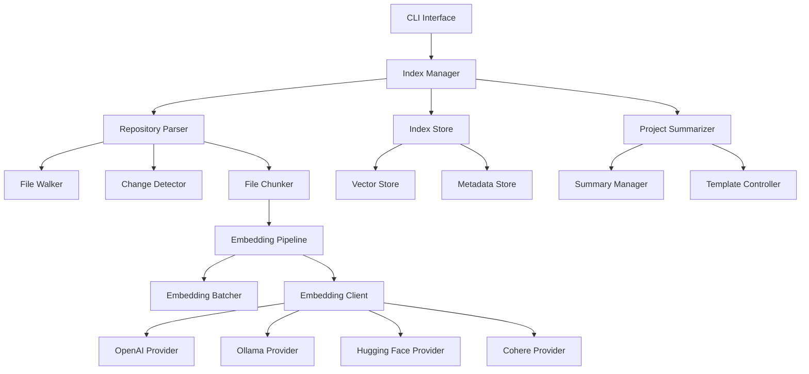

# Ziri Performance Optimization - Design Document

## Overview

This design document outlines the architecture for optimizing Ziri's indexing performance while maintaining embedding provider flexibility. The system will implement a streaming, concurrent architecture with intelligent batching, repository isolation, and incremental updates to achieve sub-60-second indexing for medium-sized repositories.

## Architecture

### High-Level Architecture



### Core Components

1. **Index Manager**: Orchestrates the entire indexing process
2. **Repository Parser**: Handles file discovery, change detection, and chunking
3. **Embedding Pipeline**: Manages concurrent embedding generation with batching
4. **Index Store**: Provides isolated storage per repository
5. **Project Summarizer**: Maintains dynamic project summaries

## Components and Interfaces

### Index Manager

The Index Manager serves as the main orchestrator for all indexing operations.

```typescript
interface IndexManager {
  indexRepository(repoPath: string, options: IndexOptions): Promise<IndexResult>
  updateRepository(repoPath: string): Promise<UpdateResult>
  getRepositoryStatus(repoPath: string): RepositoryStatus
}

interface IndexOptions {
  provider: EmbeddingProvider
  concurrency: number
  batchSize: number
  forceFullIndex: boolean
  excludePatterns: string[]
}

interface IndexResult {
  filesProcessed: number
  chunksGenerated: number
  embeddingsCreated: number
  duration: number
  repositoryId: string
}
```

### Repository Parser

Handles file system operations with streaming and change detection.

```typescript
interface RepositoryParser {
  discoverFiles(repoPath: string, excludePatterns: string[]): AsyncIterable<FileInfo>
  detectChanges(repoPath: string, lastIndex: IndexMetadata): AsyncIterable<FileChange>
  chunkFile(filePath: string): AsyncIterable<TextChunk>
}

interface FileInfo {
  path: string
  hash: string
  size: number
  lastModified: Date
}

interface FileChange {
  path: string
  changeType: 'added' | 'modified' | 'deleted'
  hash?: string
}

interface TextChunk {
  content: string
  filePath: string
  startLine: number
  endLine: number
  chunkId: string
}
```

### Embedding Pipeline

Manages concurrent embedding generation with intelligent batching.

```typescript
interface EmbeddingPipeline {
  processChunks(chunks: AsyncIterable<TextChunk>, provider: EmbeddingProvider): AsyncIterable<EmbeddedChunk>
  setBatchSize(size: number): void
  setConcurrency(level: number): void
}

interface EmbeddingBatcher {
  createBatches(chunks: TextChunk[], maxTokens: number): TextChunk[][]
  adaptBatchSize(responseTime: number, currentSize: number): number
}

interface EmbeddingClient {
  embed(texts: string[], provider: EmbeddingProvider): Promise<number[][]>
  getProviderLimits(provider: EmbeddingProvider): ProviderLimits
}
```

### Index Store

Provides isolated, efficient storage for each repository.

```typescript
interface IndexStore {
  createRepository(repoPath: string): Promise<string> // returns repositoryId
  storeEmbeddings(repositoryId: string, embeddings: EmbeddedChunk[]): Promise<void>
  removeEmbeddings(repositoryId: string, chunkIds: string[]): Promise<void>
  queryEmbeddings(repositoryId: string, query: number[], limit: number): Promise<SearchResult[]>
  getMetadata(repositoryId: string): Promise<IndexMetadata>
  updateMetadata(repositoryId: string, metadata: IndexMetadata): Promise<void>
}

interface IndexMetadata {
  repositoryPath: string
  lastIndexed: Date
  fileHashes: Map<string, string>
  totalChunks: number
  embeddingProvider: string
  version: string
}
```

### Project Summarizer

Maintains dynamic project summaries for prompt enhancement.

```typescript
interface ProjectSummarizer {
  generateSummary(repositoryId: string): Promise<ProjectSummary>
  updateSummary(repositoryId: string, changes: FileChange[]): Promise<void>
  getSummary(repositoryId: string): Promise<ProjectSummary>
}

interface ProjectSummary {
  overview: string
  technologies: string[]
  structure: DirectoryStructure
  keyComponents: ComponentInfo[]
  lastUpdated: Date
}
```

## Data Models

### Repository Storage Structure

Each repository gets an isolated storage directory:

```
~/.ziri/
├── repositories/
│   ├── {repo-hash-1}/
│   │   ├── vectors.db          # Vector embeddings
│   │   ├── metadata.json       # Index metadata
│   │   ├── file-hashes.json    # File change tracking
│   │   └── project_summary.md  # Generated summary
│   └── {repo-hash-2}/
│       ├── vectors.db
│       ├── metadata.json
│       ├── file-hashes.json
│       └── project_summary.md
└── config/
    ├── providers.json          # Embedding provider configs
    └── settings.json           # Global settings
```

### Vector Storage Schema

```typescript
interface VectorRecord {
  id: string              // chunk identifier
  vector: number[]        // embedding vector
  content: string         // original text content
  filePath: string        // source file path
  startLine: number       // chunk start line
  endLine: number         // chunk end line
  fileHash: string        // file hash for change detection
  createdAt: Date         // indexing timestamp
}
```

### Configuration Schema

```typescript
interface ZiriConfig {
  defaultProvider: EmbeddingProvider
  providers: {
    [key: string]: ProviderConfig
  }
  performance: {
    concurrency: number
    batchSize: number
    memoryLimit: number
  }
  exclusions: {
    patterns: string[]
    extensions: string[]
  }
}

interface ProviderConfig {
  type: 'openai' | 'ollama' | 'huggingface' | 'cohere'
  apiKey?: string
  baseUrl?: string
  model: string
  dimensions: number
  maxTokens: number
  rateLimit: {
    requestsPerMinute: number
    tokensPerMinute: number
  }
}
```

## Error Handling

### Retry Strategy

Implement exponential backoff with jitter for API failures:

```typescript
interface RetryConfig {
  maxRetries: number
  baseDelay: number
  maxDelay: number
  jitter: boolean
}

class RetryHandler {
  async executeWithRetry<T>(
    operation: () => Promise<T>,
    config: RetryConfig
  ): Promise<T>
}
```

### Error Recovery

1. **API Failures**: Retry with exponential backoff, fallback to alternative providers
2. **Memory Issues**: Reduce batch sizes, implement streaming checkpoints
3. **File System Errors**: Skip problematic files, log for manual review
4. **Corruption**: Rebuild index from scratch with user confirmation

## Testing Strategy

### Unit Tests

- **Repository Parser**: File discovery, change detection, chunking logic
- **Embedding Pipeline**: Batching algorithms, concurrency management
- **Index Store**: CRUD operations, isolation verification
- **Project Summarizer**: Summary generation and updates

### Integration Tests

- **End-to-End Indexing**: Full repository indexing with different providers
- **Incremental Updates**: Change detection and partial re-indexing
- **Provider Switching**: Configuration changes and data migration
- **Performance Benchmarks**: Timing and memory usage validation

### Performance Tests

- **Concurrency Scaling**: Test optimal concurrency levels
- **Batch Size Optimization**: Measure throughput vs batch size
- **Memory Usage**: Monitor peak memory consumption
- **Provider Comparison**: Benchmark different embedding providers

### Test Data

- **Small Repository**: 100-500 files for quick validation
- **Medium Repository**: 1000-5000 files for performance testing
- **Large Repository**: 10000+ files for stress testing
- **Mixed Content**: Various file types and sizes

## Implementation Phases

### Phase 1: Core Architecture
- Repository isolation and storage structure
- Basic streaming file processing
- Simple embedding pipeline

### Phase 2: Performance Optimization
- Concurrent processing implementation
- Intelligent batching algorithms
- Memory optimization

### Phase 3: Provider Flexibility
- Multiple embedding provider support
- Configuration management
- Provider switching capabilities

### Phase 4: Advanced Features
- Incremental updates and change detection
- Project summary generation
- Progress monitoring and statistics

### Phase 5: Polish and Optimization
- Error handling and recovery
- Performance tuning
- Documentation and testing